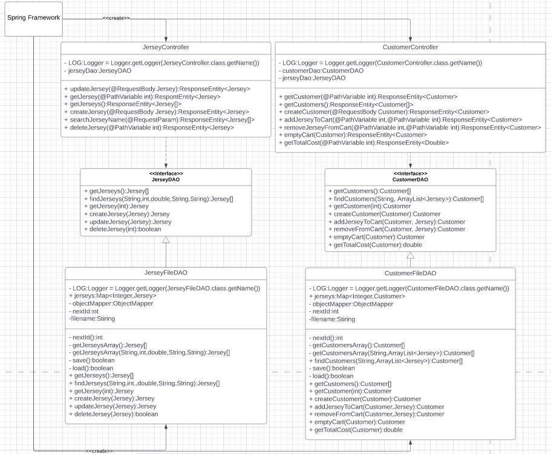
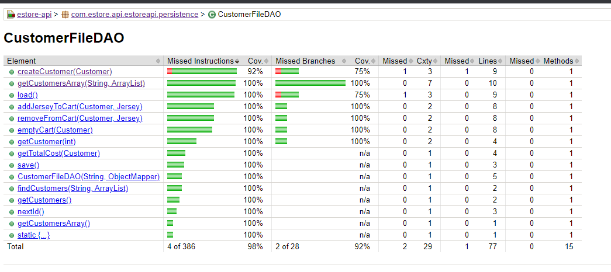
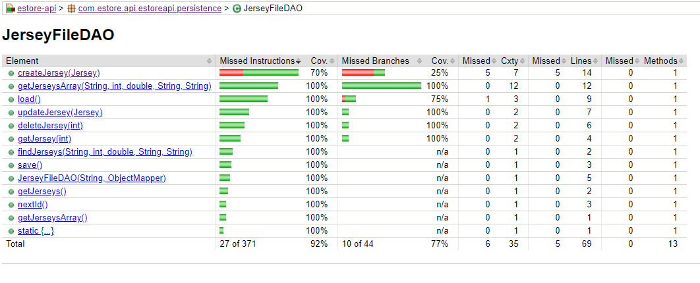
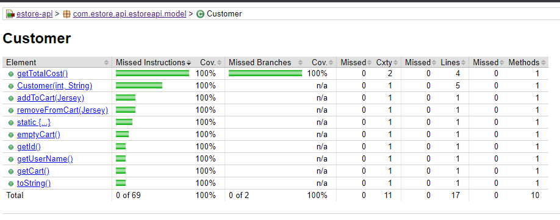
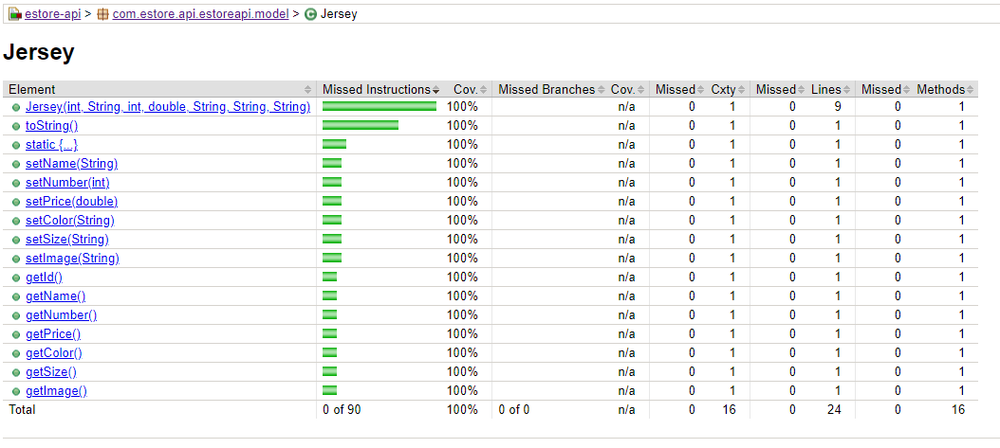

# PROJECT Design Documentation

# Team Information
* Team name: BLACKHAWKS
* Team members
  * HAYDEN CABRAL
  * ETHAN ABBATE
  * ANGELA NGO
  * VINCENT SCHWARTZ

# Executive Summary

The project is an NHL jersey store for the Chicago Blackhawks. In addition to the store itself, the project will contain the tools necessary for an administrator to control the inventory of products.

## Purpose

This project is a jersey store for the NHL franchise Chicago Blackhawks. The most important user group for this project is the customer, as a vast majority of
design decisions rely on making a great customer experience while shopping on the e-store.

## Glossary and Acronyms
> _Provide a table of terms and acronyms._

| Term | Definition |
|------|------------|
| SPA | Single Page |

# Requirements

This section describes the features of the application.

Inventory editing
Interactive storefront
Color accessibility settings
login/logout with admin privileges

## Definition of MVP
NHL Jersey store with the capability to persist with the user who shopped there. In addition, the store should have the capability to edit the inventory in various ways.

## MVP Features
Buyer
Owner
Maintain Inventory
Color Blindness Accessibility

## Roadmap of Enhancements
As an effort to make the estore as accessible as possible, we are planning to implement a number of settings for different types of color blindless. In addition, several aesthetic and functional improvements such as REACT, storing our jerseys in a database using POSTRGRSQL, and others to make a more streamlined and professional experience.

## Application Domain

This section describes the application domain.

Almost everything within the domain depends on whether the user is an admin or not, as in each case many features become available depending on the answer. In addition, the Jersey object is the backbone of the store, as this is the only product that the store will sell.

# Architecture and Design

This section describes the application architecture.

## Summary

The following Tiers/Layers model shows a high-level view of the webapp's architecture.

The e-store web application, is built using the Model–View–ViewModel (MVVM) architecture pattern. 

The Model stores the application data objects including any functionality to provide persistance. 

The View is the client-side SPA built with Angular utilizing HTML, CSS and TypeScript. The ViewModel provides RESTful APIs to the client (View) as well as any logic required to manipulate the data objects from the Model.

Both the ViewModel and Model are built using Java and Spring Framework. Details of the components within these tiers are supplied below.

## Overview of User Interface

This section describes the web interface flow; this is how the user views and interacts
with the e-store application.

The user interface will begin with the default page of the storefront. Once there, the user will have the option to login as a customer or admin. If an admin, they will be taken to an inventory management page. If a user, they will be taken to a page to browse the available inventory where they can add jerseys into their cart. In addition, after the customer browses the store, they will navigate to a cart page then to checkout page where they will be able to pay for their items.

## View Tier
The View Tier UI of the Estore should be a cohesive, connected experience in which all components of the UI are somehow interconnected. From the very beginning of the experience, the login page registers and confirms information about the user, whether they are an admin or not, and their username. This page also holds the accessibility settings relating to the UI, so that different users of varying colorblinness can use the store. If they are an admin, denoted by the 'admin' username, they are taken to a seperate page from the rest of the estore, in which they are able to add to, modify, and delete the existing inventory. Otherwise, if they are a regular user, they are taken to the main page of the estore. In this page, the user is able to browse the selection of jerseys and search for any specific one they want. Once they have decided on their selection(s), they are able to add those jerseys to their cart, which will persist if not emptied or checked out. After they view the cart, they are able to 
navigate to a checkout form in which the cart will empty and they will purchase their products.

For the accessibility settings the user can press the accessibility dropdown. Then they recieve the options and can select based on their colorblindness type or a high contrast mode (colorblind modes: Deuternopia, Protanopia). Then the Jersey store will change colors based off the chosen colorblind mode.

For the admin features such as updating the jersey first the admin must log in. Once they log in as an admin they will be viewing all the current jerseys that are in the inventory in the storefront. They can then click the specific jersey and then the page will switch to showing the jersey details. There will be text boxes that show the current data within the jersey and then the admin change change the details accordingly. Once the admin clicks the "save" button it will then update the JSON file containing the jerseys and then the storefront will then display the updated jersey.

An admin will log in or again to access the inventory storefront. Then when the click the add button the website will display an empty text boxes, the admin is required to input all fields with valid data or else the jersey will not be added. Once the new jersey is going to be added to the JSON there will be a check if that exact jersey already exists, if so then it will fail to be added. Otherwise if it is a unique jersey it will be added to the inventory and displayed to the storefront.

For delete, an admin will login and view all jerseys. Then they can click a jersey and it will display the jersey details, then can click the delete button. This will delete the jersey from the JSON file and show it is no longer in the storefront.

For searching for a jersey an admin will log into the store. They can then put in search terms to find a specific jersey they want to look for to either update or delete that jersey. From the search terms the jerseys that match are displayed on the storefront to the admin.

## ViewModel Tier
<!-- > _Provide a summary of this tier of your architecture. This
> section will follow the same instructions that are given for the View
> Tier above.

> _At appropriate places as part of this narrative provide one or more
> static models (UML class diagrams) with some details such as critical attributes and methods. -->

> The main purpose of these classes is to provide persistence of the information in our json files. A shared method between these classes is *save()* 
> and *load()*. 
> - **save()** - is called when making changes to the json file 
> - **load()** - is called when wanting to reload the json file to get its most recent changes 

### CustomerFileDAO 
This class **inherits** from CustomerDAO and uses this in the CustomerController as a form of dependency injection 

| Attribute       | Type                  | Purpose                                                     |
| -----------     | -----------           | -----------                                                 |
| **LOG**         | Logger                | to log messages                                             |
| **customers**   | Map<Integer, Customer>| provides a local cache of the customer objects              |
| **objectMapper**| ObjectMapper          | provides conversion between customer objects and JSON text  |
| **nextId**      | int                   | the next id to assign to a new customer                     |
| **filename**    | String                | filename to read from and write to                          |

This class is for persisting the information of each of the customers carts and other information. In this class you can find a customer, get all the customers, create a customer, add a jersey to the customer's cart, remove an item from the 
cart, get the total cost of the cart, and empty the entire cart. The error handling is mostly in the methods that deal 
with interacting with the Customer’s information. So essentially, if the Customer doesn’t exist in the json file, it will return null. 

### CustomerController
| Attribute       | Type        | Purpose                                             |
| -----------     | ----------- | -----------                                         |
| **LOG**         | Logger      | to log messages                                     |
| **customerDAO** | CustomerDAO | allows access to CRUD methods that change the json  |
| **jerseyDAO**   | JerseyDAO   | allows access to methods to fetch needed jerseys    | 

This class is for handling the REST API requests for the customer resource. In this class you can get a single customer
via their id, get all existing customers, create a new customer, add a jersey to a customer's cart, remove a jersey from
a customer's cart, empty a customer's cart, and get the total cost of all of the jerseys in the customer's cart.
The error handling is dealt with by the DAOs and it will react by sending appropriate HTTP status codes such as 200.OK,
201.CREATED, 409.CONFLICT, 404.NOT_FOUND, and 500.INTERNAL_SERVER_ERROR

### JerseyFileDAO 
This class **inherits** feom JerseyDAO and uses this in the JerseyController as a form of dependency injection 

| Attribute       | Type                  | Purpose                                                   |
| -----------     | -----------           | -----------                                               |
| **LOG**         | Logger                | to log messages                                           |
| **customers**   | Map<Integer, Jersey>  | provides a local cache of the jersey objects              |
| **objectMapper**| ObjectMapper          | provides conversion between jersey objects and JSON text  |
| **nextId**      | int                   | the next id to assign to a new jersey                     |
| **filename**    | String                | filename to read from and write to                        |

This class is for persisting the information of each of the jerseys. In this class you can find a jersey, get all the
jerseys, create a jersey, get a single jersey, delete a jersey, and update a jersey. The error handling is mostly in the > methods that deal with interacting with the jersey's information. So essentially, if the jersey doesn’t exist in the json > file, it will return null. 

### JerseyController
| Attribute       | Type        | Purpose                                             |
| -----------     | ----------- | -----------                                         |
| **LOG**         | Logger      | to log messages                                     |
| **jerseyDAO**   | JerseyDAO   | allows access to CRUD methods that change the json  | 

This class is for handling the REST API requests for the jersey resource. In this class you can get a single jersey
via its id, get all existing jerseys, create a new jersey, update an existing jersey, and delete and existing jersey.
The error handling is dealt with by the JerseyDAO and it will react by sending appropriate HTTP status codes such as 200. OK, 201.CREATED, 409.CONFLICT, 404.NOT_FOUND, and 500.INTERNAL_SERVER_ERROR

## Model Tier

There are two classes that make up our object, that will be the Jersey and Customer class. 

**Jersey Class**
> The jersey class consists of the following attributes: 
> 1. Id of jersey
> 2. Name
> 3. Size
> 4. Color 
> 5. Number (on the jersey)
> 6. Price
> 7. Image 
> These attributes can be accessed through accessors and can be changed through mutators.

**Customer Class**
> _In the customer class, there are 3 attributes: id, username and cart. These 
> attributes have various methods in them to access and mutators in them. The only methods that are different from average
> mutators are the ones for the cart attribute. Since cart is an ArrayList of Jerseys, the user can choose to remove or add > a jersey to the cart or remove all instances of the jersey from the cart._

> **special methods**
> - totalCost() method 
>      - that gets the total cost from iterating through the cart arraylist and adding up the prices.
> - EmptyCart() method
>     - a special method that empties out all the instances of the Jerseys in the cart Arraylist

The way that the two classes interact is that the Customer class has a cart that can contain Jerseys, since the Customer can buy different Jerseys. 

## Static Code Analysis/Design Improvements

Overall our API had good coverage, no duplications, bugs or vulnerabilities. One thing
that can be improved on our API is that there is many code smells. Most of the major issues
were issues with large blocks of code that were unused were commented out instead of deleted.
In order to keep our code clean we should have deleted most of these unused blocks. Some of the
critical issues were about static methods or hardcoded strings so it would be a good idea to make
sure we are using java principles like static right with some of the methods. It would be a good
idea to try and get more code coverage as well.

Overall our UI did have a good number of bugs but everything else was good. The bugs
boil down to adding header tags or description to some of the tables that we used within
our UI. Some other issues were some commented out code and deprecated attributes in the css.
In the future it would be good to be more descriptive and use good standards when it comes
to certain HTML elements such as tables. We also need to utilize the power of Angular better
and understand it more in order to be able to work more effectively.

# Testing
> _This section will provide information about the testing performed
> and the results of the testing._

## Acceptance Testing
| How many user stories have... | Number |
| ----------- | ----------- |
| **passed**  | 20   |
| **some acceptance criteria failing** | 5       |
| **that havent been tested yet** | 6   |

### **Issues During Acceptance testing**
> - There is an issue with when after you add your jersey to your cart, and then you get its total cost of the entire cart, but when you try to remove it from the cart right after 
> it doesnt allow you to delete anything from it
> - Customers not being able to be created during the login process, this is being dealt with by refactoring the code to not include the Cart object inside of a Customer object 
> since it may have lead to some problems 
> - Have to redo testing for Controller methods for the Customer because of refactoring, but otherwise it should be fine 

## Unit Testing and Code Coverage

### Unit Testing Strategy 

> The goal we want to achieve is 90%-100% code coverage. In order to get to that goal, we have decided to do thorough testing in order to get the highest coverage possible. This is > our strategy thus far. 
> 1. Work on one method at a time 
> 2. Make sure to write tests for the happy path and then the “unhappy path” 
> 3. Make sure that you write tests that contain errors to see if the method is able to catch and deal with them 
> 4. If there is a problem with debugging what went wrong in unit test, consult other group members or professor for help 

#### Code Coverage As of 11/15/22
> ## Controller Tier 
> ## Persistence Tier 
> 
> 
>
> ## Model Tier 
> 
> 

#### Statement 
> As of right now, our code coverage has significantly met our expectations. The only downside as of right now is that our Controller tier has not 
> been entirely tested because of refactoring. Prior to refactoring, we were having a lot of issues with a new Customer being created. It kept on 
> running into the error that it was creating a null object, saying that createNewCustomer() method wasn’t working and returning null because of our > null case. But after a lot of troubleshooting, there are a lot of areas where the issue couldve come from e.g.  the cart and or customer not 
> created properly or something else. It was an anomaly because our tests all passed in insomnia and in the unit testing, so we weren’t sure how it 
> kept on creating a null object instead of a customer. This confused us thoroughly so we started over by getting rid of the Cart class completely 
> and using an ArrayList of Jerseys to represent the Cart in the Customer. 

