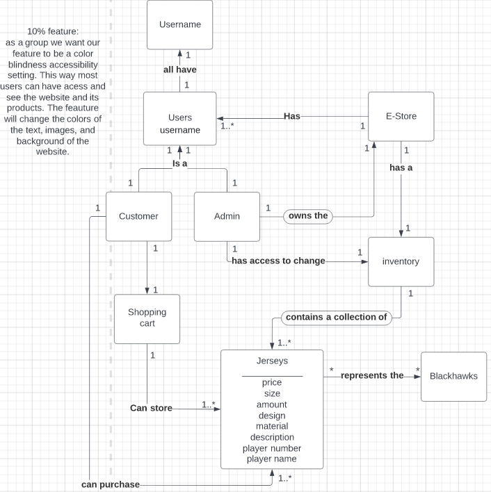

# PROJECT Design Documentation

## Team Information
* Team name: BLACKHAWKS
* Team members
  * HAYDEN CABRAL
  * ETHAN ABBATE
  * ANGELA NGO
  * VINCENT SCHWARTZ

## Executive Summary

The project is an NHL jersey store for the Chicago Blackhawks. In addition to the store itself, the project will contain the tools necessary for an administrator to control the inventory of products.

### Purpose

This project is a jersey store for the NHL franchise Chicago Blackhawks. The most important user group for this project is the customer, as a vast majority of
design decisions rely on making a great customer experience while shopping on the e-store.

### Glossary and Acronyms
> _Provide a table of terms and acronyms._

| Term | Definition |
|------|------------|
| SPA | Single Page |

## Requirements

This section describes the features of the application.

Inventory editing
Interactive storefront
Color accessibility settings
login/logout with admin priviliges

### Definition of MVP
NHL Jersey store with the capability to persist with the user who shopped there. In addition, the store should have the capability to edit the inventory in various ways.

### MVP Features
Buyer
Owner
Maintain Inventory
Color Blindness Accessibility

### Roadmap of Enhancements
As an effort to make the estore as accessible as possible, we are planning to implement a number of settings for different types of color blindless. In addition, several aesthetic and functional improvements such as REACT, storing our jerseys in a database using POSTRGRSQL, and others to make a more streamlined and professional experience.

## Application Domain

This section describes the application domain.

Almost everything within the domain depends on whether the user is an admin or not, as in each case many features become available depending on the answer. In addition, the Jersey object is the backbone of the store, as this is the only product that the store will sell.

## Architecture and Design

This section describes the application architecture.

### Summary

The following Tiers/Layers model shows a high-level view of the webapp's architecture.

The e-store web application, is built using the Model–View–ViewModel (MVVM) architecture pattern. 

The Model stores the application data objects including any functionality to provide persistance. 

The View is the client-side SPA built with Angular utilizing HTML, CSS and TypeScript. The ViewModel provides RESTful APIs to the client (View) as well as any logic required to manipulate the data objects from the Model.

Both the ViewModel and Model are built using Java and Spring Framework. Details of the components within these tiers are supplied below.

### Overview of User Interface

This section describes the web interface flow; this is how the user views and interacts
with the e-store application.

The user interface will begin with the default page of the storefront. Once there, the user will have the option to login as a customer or admin. If an admin, they will be taken to an inventory management page. In addition, after the customer browses the store, they will navigate to a checkout page where they will be able to pay for their items.df

### View Tier
The View Tier UI of the Estore should be a cohesive, connected experience in which all components of the UI are somehow interconnected. From the very beginning of the experience, the login page registers and confirms information about the user, whether they are an admin or not, and their username. This page also holds the accessibility settings relating to the UI, so that different users of varying colorblinness can use the store. If they are an admin, denoted by the 'admin' username, they are taken to a seperate page from the rest of the estore, in which they are able to add to, modify, and delete the existing inventory. Otherwise, if they are a regular user, they are taken to the main page of the estore. In this page, the user is able to browse the selection of jerseys and search for any specific one they want. Once they have decided on their selection(s), they are able to add those jerseys to their cart, which will persist if not emptied or checked out. After they view the cart, they are able to 
navigate to a checkout form in which the cart will empty and they will purchase their products.

### ViewModel Tier
> _Provide a summary of this tier of your architecture. This
> section will follow the same instructions that are given for the View
> Tier above._

> _At appropriate places as part of this narrative provide one or more
> static models (UML class diagrams) with some details such as critical attributes and methods._

### Model Tier

There are two classes that make up our object, that will be the Jersey and Customer class. 

**Jersey Class**
> The jersey class consists of the following attributes: 
> 1. Id of jersey
> 2. Name
> 3. Size
> 4. Color 
> 5. Number (on the jersey)
> 6. Price
> 7. Image 
> These attributes can be accessed through accessors and can be changed through mutators.

**Customer Class**
> _In the customer class, there are 3 attributes: id, username and cart. These 
> attributes have various methods in them to access and mutators in them. The only methods that are different from average mutators are the ones for the cart attribute. Since cart 
> is an ArrayList of Jerseys, the user can choose to remove or add a jersey to the cart or remove all instances of the jersey from the cart._

> **special methods**
> - totalCost() method 
>      - that gets the total cost from iterating through the cart arraylist and adding up the prices.
> - EmptyCart() method
>     - a special method that empties out all the instances of the Jerseys in the cart Arraylist

The way that the two classes interact is that the Customer class has a cart that can contain Jerseys, since the Customer can buy different Jerseys. 

### Static Code Analysis/Design Improvements

Overall our API had good coverage, no duplications, bugs or vulnerabilities. One thing
that can be improved on our API is that there is many code smells. Most of the major issues
were issues with large blocks of code that were unused were commented out instead of deleted.
In order to keep our code clean we should have deleted most of these unused blocks. Some of the
critical issues were about static methods or hardcoded strings so it would be a good idea to make
sure we are using java principles like static right with some of the methods. It would be a good
idea to try and get more code coverage as well.

Overall our UI did have a good number of bugs but everything else was good. The bugs
boil down to adding header tags or description to some of the tables that we used within
our UI. Some other issues were some commented out code and deprecated attributes in the css.
In the future it would be good to be more descriptive and use good standards when it comes
to certain HTML elements such as tables. We also need to utilize the power of Angular better
and understand it more in order to be able to work more effectively.

## Testing
> _This section will provide information about the testing performed
> and the results of the testing._

### Acceptance Testing
| ----------- | ----------- |
| **How many user stories have passed**  | 20   |
| **How many user stories have some acceptance criteria failing** | 5       |
| **How many user stories that havent been tested yet** | 6   |

Issues During Acceptance testing
There is an issue with when after you add your jersey to your cart, and then you get its total cost of the entire cart, but when you try to remove it from the cart right after it doesnt allow you to delete anything from it
Customers not being able to be created during the login process, this is being dealt with by refactoring the code to not include the Cart object inside of a Customer object since it may have lead to some problems 

> _Report on the number of user stories that have passed all their
> acceptance criteria tests, the number that have some acceptance
> criteria tests failing, and the number of user stories that
> have not had any testing yet. Highlight the issues found during
> acceptance testing and if there are any concerns._

### Unit Testing and Code Coverage
> _Discuss your unit testing strategy. Report on the code coverage
> achieved from unit testing of the code base. Discuss the team's
> coverage targets, why you selected those values, and how well your
> code coverage met your targets. If there are any anomalies, discuss
> those._
