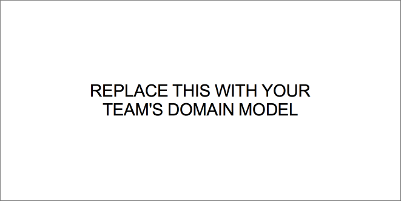

# PROJECT Design Documentation

## Team Information
* Team name: BLACKHAWKS
* Team members
  * HAYDEN CABRAL
  * ETHAN ABBATE
  * ANGELA NGO
  * VINCENT SCHWARTZ

## Executive Summary

The project is an NHL jersey store for the Chicago Blackhawks. In addition to the store itself, the project will contain the tools necessary for an administrator to control the inventory of products.

### Purpose

This project is a jersey store for the NHL franchise Chicago Blackhawks. The most important user group for this project is the customer, as a vast majority of
design decisions rely on making a great customer experience while shopping on the e-store.

### Glossary and Acronyms
> _Provide a table of terms and acronyms._

| Term | Definition |
|------|------------|
| SPA | Single Page |

## Requirements

This section describes the features of the application.

Inventory editing
Interactive storefront
Color accessibility settings
login/logout with admin priviliges

### Definition of MVP
NHL Jersey store with the capability to persist with the user who shopped there. In addition, the store should have the capability to edit the inventory in various ways.

### MVP Features
Buyer
Owner
Maintain Inventory
Color Blindness Accessibility

### Roadmap of Enhancements
> _Provide a list of top-level features in the order you plan to consider them._

## Application Domain

This section describes the application domain.

> _Provide a high-level overview of the domain for this application. You
> can discuss the more important domain entities and their relationship
> to each other._

## Architecture and Design

This section describes the application architecture.

### Summary

The following Tiers/Layers model shows a high-level view of the webapp's architecture.

The e-store web application, is built using the Model–View–ViewModel (MVVM) architecture pattern. 

The Model stores the application data objects including any functionality to provide persistance. 

The View is the client-side SPA built with Angular utilizing HTML, CSS and TypeScript. The ViewModel provides RESTful APIs to the client (View) as well as any logic required to manipulate the data objects from the Model.

Both the ViewModel and Model are built using Java and Spring Framework. Details of the components within these tiers are supplied below.

### Overview of User Interface

This section describes the web interface flow; this is how the user views and interacts
with the e-store application.

The user interface will begin with the default page of the storefront. Once there, the user will have the option to login as a customer or admin. If an admin, they will be taken to an inventory management page. In addition, after the customer browses the store, they will navigate to a checkout page where they will be able to pay for their items.df

### View Tier
> _Provide a summary of the View Tier UI of your architecture.
> Describe the types of components in the tier and describe their
> responsibilities.  This should be a narrative description, i.e. it has
> a flow or "story line" that the reader can follow._

> _You must also provide sequence diagrams as is relevant to a particular aspects 
> of the design that you are describing.  For example, in e-store you might create a 
> sequence diagram of a customer searching for an item and adding to their cart. 
> Be sure to include an relevant HTTP reuqests from the client-side to the server-side 
> to help illustrate the end-to-end flow._

### ViewModel Tier
> _Provide a summary of this tier of your architecture. This
> section will follow the same instructions that are given for the View
> Tier above._

> _At appropriate places as part of this narrative provide one or more
> static models (UML class diagrams) with some details such as critical attributes and methods._

### Model Tier
> _Provide a summary of this tier of your architecture. This
> section will follow the same instructions that are given for the View
> Tier above._

> _At appropriate places as part of this narrative provide one or more
> static models (UML class diagrams) with some details such as critical attributes and methods._

### Static Code Analysis/Design Improvements
> _Discuss design improvements that you would make if the project were
> to continue. These improvement should be based on your direct
> analysis of where there are problems in the code base which could be
> addressed with design changes, and describe those suggested design
> improvements._

> _With the results from the Static Code Analysis exercise, 
> discuss the resulting issues/metrics measurements along with your analysis
> and recommendations for further improvements. Where relevant, include 
> screenshots from the tool and/or corresponding source code that was flagged._

## Testing
> _This section will provide information about the testing performed
> and the results of the testing._

### Acceptance Testing
> _Report on the number of user stories that have passed all their
> acceptance criteria tests, the number that have some acceptance
> criteria tests failing, and the number of user stories that
> have not had any testing yet. Highlight the issues found during
> acceptance testing and if there are any concerns._

### Unit Testing and Code Coverage
> _Discuss your unit testing strategy. Report on the code coverage
> achieved from unit testing of the code base. Discuss the team's
> coverage targets, why you selected those values, and how well your
> code coverage met your targets. If there are any anomalies, discuss
> those._
